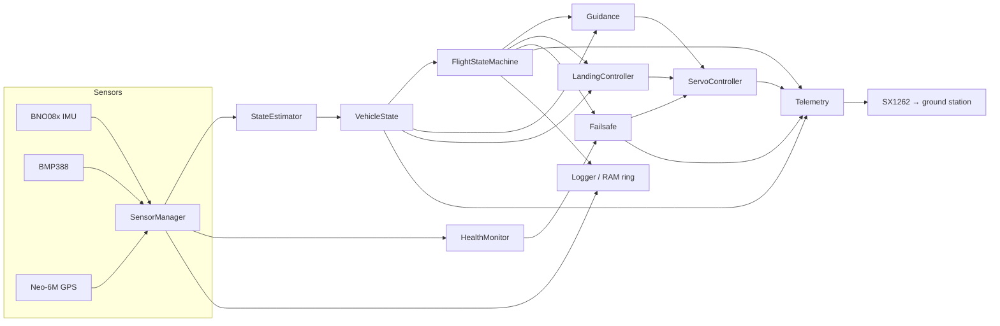

# PHOENIX RECOVERY — Architecture

Autonomous **guided parafoil recovery** for a model rocket.
The flight controller only steers two parafoil brake-line servos **during descent**.
It never commands ascent, never ignites the motor, and never fires any pyrotechnic.

> This document is the top-level design. See
> [`PIN_MAP.md`](PIN_MAP.md), [`SAFETY_STATE_MACHINE.md`](SAFETY_STATE_MACHINE.md)
> and [`TEST_PLAN.md`](TEST_PLAN.md) for the pinout, state machine and test plan.

---

## 1. Safety scope (non-negotiables)

| Concern | Software role | Software role is **NOT** |
|---|---|---|
| Powered ascent | Log + telemetry only, servos pinned neutral | Steering / thrust control |
| Motor ignition | None | Ignition of the motor |
| Ejection charge | Detects apogee, **waits** for motor ejection | Firing the charge |
| Descent | Steers parafoil brake lines after deployment | Control of a rigid/ballistic vehicle |
| Servo movement | Allowed only in guided states, with slew limits | Uncontrolled movement on boot / error |

Design rules 1–10 from the specification are encoded in `src/config.h` and the
control-path guards in `main.cpp`. They are repeated in
[`SAFETY_STATE_MACHINE.md`](SAFETY_STATE_MACHINE.md) §1.

---

## 2. Hardware summary

| Item | Part | Interface |
|---|---|---|
| Flight controller | Heltec WiFi LoRa 32 V4 (ESP32-S3R2, 16 MB flash) | Native USB-Serial/JTAG (`/dev/cu.usbmodem*`) |
| IMU | GY-BNO08X (Bosch BNO080/085) @ `0x4B` | I2C on GPIO47/48, INT GPIO1 |
| Barometer | BMP388 @ `0x76` | I2C on GPIO47/48 (CS held high) |
| GPS | GY-NEO6MV2 (u-blox NEO-6M) | UART2 RX=38, TX=39, 9600 baud, PPS=41 optional |
| Actuators | 2× steering servos (brake lines) | GPIO4 (left), GPIO6 (right), external UBEC 5 V |
| Radio | SX1262 LoRa (on-board) | NSS=8, SCK=9, MOSI=10, MISO=11, RST=12, BUSY=13, DIO1=14 |
| Power | 2S LiPo → 5 V / 5 A UBEC | Heltec 5V input; servos direct from UBEC; sensors from 3.3 V |

Detailed wiring and the pin-change procedure are in [`PIN_MAP.md`](PIN_MAP.md).

---

## 3. Repository layout

```
phoenix-recovery/
├── platformio.ini            # rocket, ground, native test environments
├── README.md                 # full operator / developer guide
├── docs/
│   ├── ARCHITECTURE.md       # this file
│   ├── PIN_MAP.md
│   ├── SAFETY_STATE_MACHINE.md
│   ├── TEST_PLAN.md
│   └── GROUND_TEST_CHECKLIST.md
├── firmware/                 # rocket flight controller (env: rocket)
│   └── src/
│       ├── main.cpp          # wiring / task loop only — no logic
│       ├── config.h          # ALL tunable constants + pin map
│       ├── flight_state.h    # state enum + human-readable names
│       ├── flight_state.cpp
│       ├── vehicle_state.h   # central VehicleState struct
│       ├── logic/            # 100% hardware-free, unit-testable
│       │   ├── nav_math.h
│       │   ├── filters.h
│       │   ├── state_machine.h
│       │   ├── guidance_logic.h
│       │   ├── detection.h            # launch / apogee / landing
│       │   └── data_quality.h
│       ├── sensors/
│       │   ├── imu.{h,cpp}            # BNO08x wrapper
│       │   ├── barometer.{h,cpp}      # BMP388 wrapper
│       │   ├── gps.{h,cpp}            # TinyGPSPlus wrapper
│       │   └── sensor_manager.{h,cpp} # combined read + plausibility
│       ├── control/
│       │   ├── servo_controller.{h,cpp}
│       │   ├── guidance.{h,cpp}       # mode selection -> logic
│       │   └── landing_controller.{h,cpp}
│       ├── estimation/
│       │   ├── state_estimator.{h,cpp}
│       │   ├── altitude_filter.{h,cpp}
│       │   └── heading_estimator.{h,cpp}
│       ├── telemetry/
│       │   ├── telemetry_packet.h     # binary packet layout + CRC
│       │   └── telemetry.{h,cpp}      # SX1262 send
│       ├── safety/
│       │   ├── failsafe.{h,cpp}       # fault codes + transitions
│       │   └── health_monitor.{h,cpp} # timeouts, NaN, plausibility
│       ├── logging/
│       │   ├── logger.{h,cpp}         # serial + event flash log
│       │   └── ram_ring.{h,cpp}       # RAM ring buffer (recent high-rate data)
│       └── bench/
│           └── bench_cli.{h,cpp}      # BENCH_TEST_MODE serial commands
└── ground_station/
    ├── firmware/            # ground Heltec receiver (env: ground)
    │   └── src/
    │       ├── main.cpp
    │       ├── ground_config.h
    │       └── packet_parser.{h,cpp}  # decode -> CSV line over USB
    └── python/
        ├── telemetry_monitor.py       # terminal/desktop display + CSV
        └── requirements.txt
├── tests/                    # host-native unit tests (env: native)
│   ├── test_nav_math.cpp
│   ├── test_filters.cpp
│   ├── test_state_machine.cpp
│   ├── test_guidance.cpp
│   ├── test_detection.cpp
│   ├── test_data_quality.cpp
│   └── test_scenarios.cpp    # the 10 simulation scenarios
└── tools/
    ├── flash_rocket.sh
    ├── flash_ground.sh
    └── parse_csv.py          # offline CSV inspection
```

`src/logic/` is the **only** module set that is compiled for the host `native`
environment. It has zero Arduino/ESP32 includes, so every guidance/navigation/
state-machine/data-quality decision can be unit-tested on a laptop.

---

## 4. Module responsibilities & data flow



* Every loop iteration: `SensorManager.read()` → `StateEstimator.update()` →
  `FlightStateMachine.update()` → `HealthMonitor.update()` → mode dispatch →
  `ServoController.update()` → `Telemetry.update()`.
* `VehicleState` is the single shared object between stages (spec §7). Its
  definition lives in `vehicle_state.h` and is byte-identical to the telemetry
  payload in `telemetry_packet.h` (minus the downlink-only fields).
* **No `delay()` in flight code.** The loop is free-running; each subsystem
  throttles itself with `millis()` deadlines at the rates in §6.

---

## 5. Central vehicle state

`VehicleState` (see `firmware/src/vehicle_state.h`) carries every value the
flight logic needs plus per-sensor validity + timestamps. The estimator only
publishes into it; consumers only read it. Stale data is never silently reused:
each field has a companion `*_ts_ms` or the sensor `valid` flags, and the
health monitor stamps `data_age_ms`.

---

## 6. Timing / task plan

Free-running loop, per-subsystem throttle (no blocking waits):

| Subsystem | Rate | Notes |
|---|---|---|
| IMU (BNO08x) | 50–100 Hz | SH2 report-driven; events polled each loop |
| Barometer (BMP388) | 25–50 Hz | ODR 25 Hz default; IIR filter |
| GPS (Neo-6M) | native 1–5 Hz | drained non-blocking from UART RX |
| State estimator | 50 Hz | vertical speed filter, heading |
| Guidance | 10–20 Hz | proportional steering, slew-limited |
| Servo output | 50 Hz | ESP32Servo refresh |
| Telemetry (LoRa) | phase-dependent | pad 1 Hz, ascent/guided 5–10 Hz, landed 0.5–1 Hz |
| Health monitor | 5–10 Hz | timeouts, NaN, plausibility |
| Flash event log | on-change | boot, faults, launch, apogee, landed, reset |

Rates are configurable in `config.h` (`RATE_*_HZ`).

---

## 7. Flight state machine

Defined in `logic/state_machine.h` (pure logic) and `flight_state.h` (enum +
names). All 12 required states and the guard conditions for every transition are
documented in [`SAFETY_STATE_MACHINE.md`](SAFETY_STATE_MACHINE.md).

Key safety properties:
* Servos are pinned **neutral** in `BOOT`, `SELF_TEST`, `PAD_SAFE`, `ASCENT`,
  `APOGEE_TRANSITION`, `PARAFOIL_DEPLOYMENT_WAIT`, `PARAFOIL_STABILIZATION`,
  and `LANDED`.
* Only `GUIDED_DESCENT`, `FINAL_APPROACH` and (if enabled) `FLARE` may move
  servos — always through the slew-limited servo controller.
* Any fault, watchdog expiry, or failed transition lands in `FAILSAFE` with a
  unique `FAIL_*` code and `emergencyNeutral()`.

---

## 8. Estimation

| Quantity | Method | Source |
|---|---|---|
| Relative altitude | IIR-filtered BMP388, launch-ground reference | `altitude_filter` |
| Vertical speed | 1st-order low-pass on filtered altitude differences (not raw two-sample dP/dt) | `altitude_filter` / `filters.h` |
| Heading / course | GPS course-over-ground when `ground_speed` above threshold; BNO08x yaw only for attitude context (magnetic distortion tolerance) | `heading_estimator` |
| Attitude | BNO08x quaternion → roll/pitch/yaw (debug) | IMU driver |
| Position | GPS; stale-held on loss with `gps_stale_ms` | `gps` driver |

Filter constants (`ALT_FILTER_TAU`, `VS_FILTER_TAU`, `COURSE_SPEED_THRESHOLD_MPS`)
are configurable. See `estimation/altitude_filter.*`.

---

## 9. Guidance control path

1. `Guidance` computes target range/bearing and heading error (normalized to
   ±180°) using pure logic in `logic/nav_math.h`.
2. Steering demand = `KP * heading_error`, passed through `logic/guidance_logic.h`:
   deadband → clamp to `MAX_BRAKE_COMMAND` → rate-limit → servo slew-limit.
3. `ServoController` maps the demand to independent left/right microsecond
   pulse widths using per-servo neutral/min/max and optional reversal flags.
4. `FINAL_APPROACH` relaxes gain and clamps steering; `FLARE` is **disabled by
   default** (`FLARE_ENABLED=false`) and gated on drop-testing.

Guidance modes: `MODE_DISABLED`, `MODE_HEADING_TO_TARGET`,
`MODE_FINAL_APPROACH`, `MODE_FLARE`, `MODE_FAILSAFE`.

---

## 10. Telemetry

* Binary packet (`telemetry_packet.h`) — fixed 16-bit aligned struct, versioned,
  with packet sequence number + 16-bit CRC (CCITT). **No JSON over LoRa.**
* Downlink includes: state, lat/lon, alt AGL, vertical/ground speed, course,
  range/bearing/heading-error to target, left/right servo, sats, HDOP, validity
  flags, failsafe code, LoRa RSSI/SNR.
* Rates per phase (§6). Rocket → ground station → USB serial → Python app
  (`ground_station/python/telemetry_monitor.py`) which displays a live table
  and appends rows to `flight_<timestamp>.csv` (columns in spec §29).

---

## 11. Logging (no SD card)

* **RAM ring buffer** (`logging/ram_ring.*`) — recent high-rate samples, dumped
  on demand over serial/LoRa.
* **LoRa** — the normal flight telemetry stream.
* **Internal flash (LittleFS, optional)** — event log only: boot, sensor
  failure, launch, apogee, guidance enable, failsafe, landed, reset reason.
  Never continuous high-frequency writes. Flash logging default **off**
  (`FLASH_EVENT_LOG_ENABLED=false`).

---

## 12. Safety layers

1. **Watchdog** — hardware WDT + software loop-health counter (low-loop-rate → fault).
2. **Boot neutral** — servos commanded neutral before any sensor init.
3. **Self-test gate** — missing IMU/barometer → `FAILSAFE`, guidance never enabled.
4. **Data quality** — NaN/invalid/implausible rejection per sensor
   (`logic/data_quality.h`), last-good held with timestamps.
5. **State machine guards** — guidance only reachable through the staged descent
   path; each transition has explicit multi-signal confirmation.
6. **Slew/rate limiting** — no instant or alternating full-brake commands.
7. **Failsafe** — deterministic `emergencyNeutral()` + reason code; telemetry
   continues if radio is alive.

Fault codes (spec §15) live in `safety/failsafe.h`:
`FAIL_NONE, FAIL_IMU, FAIL_BAROMETER, FAIL_GPS_TIMEOUT, FAIL_NAV_INVALID,
FAIL_SERVO, FAIL_CONTROL_LOOP, FAIL_SENSOR_DATA, FAIL_UNKNOWN`.

---

## 13. Simulation & tests

* `logic/` is Arduino-free → the `native` PIO environment compiles the same
  navigation/guidance/state-machine code as pure C++ and runs `pio test -e native`.
* The 10 required scenarios (spec §19) are implemented as host tests in
  `tests/test_scenarios.cpp` with synthetic trajectories.
* `SIMULATION_MODE` (config) lets the **on-board** firmware rehearse the same
  pipeline with synthetic sensor data, so the full stack can be exercised on the
  bench before any hardware is trusted.

See [`TEST_PLAN.md`](TEST_PLAN.md) for the full test matrix and phase gates.

---

## 14. Bench test mode

`BENCH_TEST_MODE` (config) disables launch detection and autonomous guidance
and opens a USB serial CLI (`bench/bench_cli.*`): `status, imu, baro, gps,
lora, servo neutral/left/right/brake, target, state, health, reset`. Commands
and travel limits are documented in [`TEST_PLAN.md`](TEST_PLAN.md) §4 and
`README.md`.

---

## 15. Development phases (spec §25)

| Phase | Content | Gate |
|---|---|---|
| 1 | Boot, serial, no servos | serial banner |
| 2 | I2C scan, BNO08x, BMP388 | sensor test app |
| 3 | GPS | NMEA/fix readout |
| 4 | LoRa rocket↔ground | packet RSSI/SNR |
| 5–6 | One, then two servos (horns removed) | neutral→small deflection |
| 7 | State estimator | bench sanity |
| 8 | Flight state machine | host + bench |
| 9 | Guidance simulation | `pio test -e native` |
| 10 | Ground-test guidance | checklist §5 |
| 11 | Parafoil drop-test mode | supervised drop tests |
| 12 | Enable real autonomous guidance | only after phases 1–11 |

**No phase is skipped.** Hardware validation claims are only made after the
corresponding physical test is actually performed (see `docs/GROUND_TEST_CHECKLIST.md`).

---

## 16. Known limitations (recorded honestly)

* No hardware servo/parafoil measurements exist yet — all brake travel, neutral
  offsets and max deflections are **placeholder defaults** to be replaced from
  bench data (`config.h`, section `SERVO_*`, `MAX_BRAKE_COMMAND`).
* BNO08x yaw is not used for navigation until drop tests validate magnetic
  behavior; navigation heading is GPS course-over-ground.
* LoRa link budget / packet size vs rate at 915 MHz must be validated on the
  ground before any flight (phase 4).
* PSRAM (2 MB per spec) is enabled at build time; its presence is asserted at
  runtime in SELF_TEST.
* Flare is disabled by default and only enabled after drop testing.
