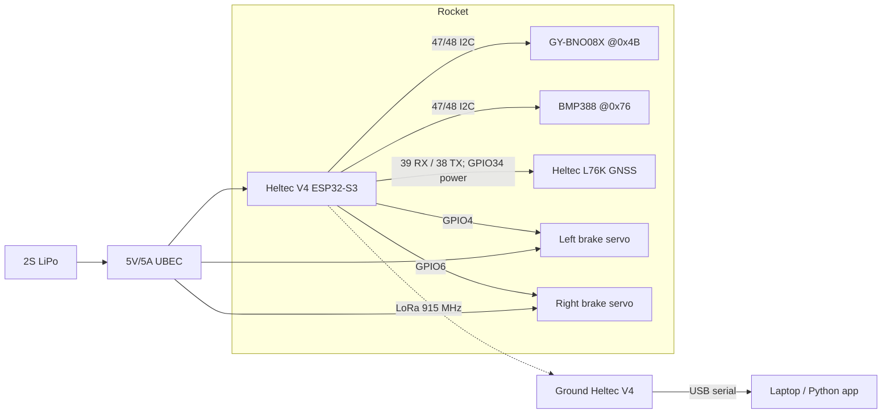

# PHOENIX RECOVERY — Pin Map

Verified against the **installed** Heltec WiFi LoRa 32 V4 variant definition
(`~/Library/Arduino15/packages/esp32/hardware/esp32/3.3.10/variants/heltec_wifi_lora_32_V4/pins_arduino.h`)
and the ESP32-S3 datasheet. Board = **Heltec WiFi LoRa 32 V4, ESP32-S3R2,
16 MB flash** (flash size verified on the physical board via esptool `flash-id`).

---

## 1. Board-native pins (Heltec V4) — do not redefine

| Function | GPIO | Notes |
|---|---|---|
| LoRa NSS/CS | **8** | SX1262 chip select |
| LoRa SCK | **9** | shared SPI |
| LoRa MOSI | **10** | shared SPI |
| LoRa MISO | **11** | shared SPI |
| LoRa RST | **12** | SX1262 reset |
| LoRa BUSY | **13** | SX1262 busy |
| LoRa DIO1 | **14** | SX1262 IRQ |
| OLED SDA | 17 | **unused** (spec: no OLED) |
| OLED SCL | 18 | **unused** |
| OLED RST | 21 | **unused** |
| Default I2C SDA | 3 | default `Wire` pins — **we do not use them** |
| Default I2C SCL | **4** | ⚠️ see caution §4 — GPIO4 is repurposed as LEFT servo |
| LED_BUILTIN | 35 | may be used as a status LED |
| Vext | 36 | leave floating / unused |
| UART TX | 43 | default serial (USB CDC used instead) |
| UART RX | 44 | default serial |

These values are exposed in `firmware/src/config.h` under `HELTEC_*` constants
and are passed to RadioLib. **Never** redefine GPIO 8–14.

---

## 2. Application pin map (default)

| Signal | GPIO | Direction | Notes |
|---|---|---|---|
| I2C SDA (sensor bus) | **47** | both | BNO08x SDA + BMP388 SDI (I2C) |
| I2C SCL (sensor bus) | **48** | both | BNO08x SCL + BMP388 SCK (I2C) |
| BNO08x INT | **1** | in | optional; polled fallback works |
| BMP388 CS | — | — | **hard-wired to 3.3 V** (I2C mode) |
| BMP388 SDO/SAO | — | — | **hard-wired to GND** → address `0x76` |
| L76K UART RX (from GNSS TX) | **39** | in | 9600 8N1 |
| L76K UART TX (to GNSS RX) | **38** | out | 9600 8N1 |
| L76K PPS | **41** | in | optional |
| L76K power control | **34** | out | active LOW (`VGNSS_CTRL`) |
| LEFT brake servo signal | **4** | out | ESP32Servo; ⚠️ default I2C SCL on this board |
| RIGHT brake servo signal | **6** | out | ESP32Servo |

All assignment lives in `config.h` (`PIN_*` constants). To rewire, edit only
`config.h` — no other file references raw GPIO numbers.

---

## 3. Power

| Rail | Source | Loads |
|---|---|---|
| 5 V | UBEC (5 V / 5 A) from 2S LiPo | Heltec `5V` input, both servos |
| 3.3 V | Heltec regulator | BNO08x, BMP388, L76K GNSS |
| GND | common | ESP32, servos, sensors all share ground |

* Servo ground and ESP32 ground **must** be common (spec §1). Solder/shared bus,
  not a second floating supply.
* L76K GNSS uses the Heltec V4 GNSS connector and its active-low GPIO34 power gate.
* If GNSS browns out the 3.3 V rail during acquisition, use a small external 3.3 V
  regulator — keep ground common.

---

## 4. Critical cautions

1. **GPIO4 is the board's default I2C SCL.** We repurpose it as the left servo.
   The ESP32 core's `TwoWire::begin()` is a no-op once the bus is started, so the
   protection is: **always call `Wire.begin(PIN_I2C_SDA, PIN_I2C_SCL)` before any
   sensor library `begin()`, and never call a bare `Wire.begin()`.** The sensor
   manager does this; the BNO08x and BMP388 drivers pass `&Wire` in after the
   bus is already on 47/48. (Verified behavior on core 3.3.10.)
2. **Strapping pins GPIO0/3/45/46 are avoided.** GPIO3 (default SDA) is a
   strapping pin — another reason not to use the default I2C pins.
3. **L76K RX/TX are 3.3 V logic.** Use the keyed Heltec GNSS connector or
   verify TX/RX orientation before applying power.
4. **LoRa SPI is private to the radio.** Do not attach other SPI devices to
   GPIO 9/10/11.
5. **Servo signal wires only** to the ESP32 — servos draw power from the UBEC,
   not from the ESP32 5V/3.3V rails.
6. **BNO08x address is 0x4B** (module ADDR pin high / GY-BNO08X default on this
   unit). Confirmed by I2C scan + register probe during bring-up. The SparkFun
   library is instantiated with `begin(0x4B, Wire, ...)`.
7. **BMP388 is at 0x76** (SDO/SAO → GND). Confirmed by chip-ID read (`0x50`).
8. **PSRAM** (2 MB per spec) is enabled via the PlatformIO board option
   `board_build.psram = enabled`; SELF_TEST asserts `psramFound()`.

---

## 5. Wiring diagram

---

## 6. Changing the pin map

1. Edit `firmware/src/config.h` (`PIN_*`).
2. The sensor manager (`sensors/sensor_manager.cpp`) and `main.cpp` are the only
   consumers — they read `config.h`.
3. Re-run SELF_TEST (`pio run -e rocket` + bench `status`) to confirm the bus
   still finds BNO08x at its address and BMP388 at `0x76`.
4. Update this file to keep documentation in sync.
