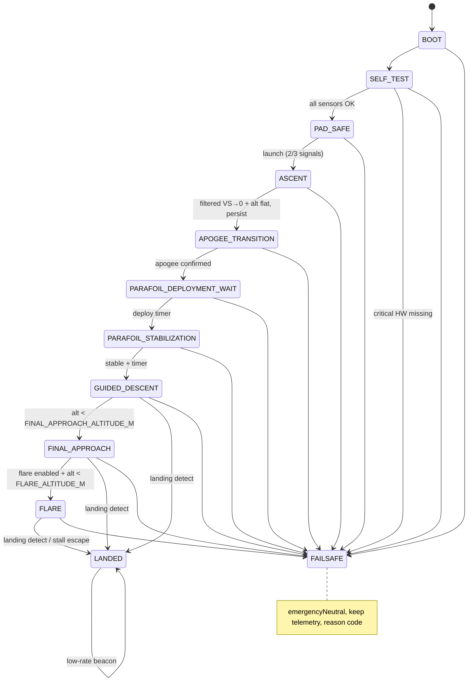

# PHOENIX RECOVERY — Safety & State Machine

The authoritative behavior contract for the flight state machine. The logic is
implemented (pure, host-testable) in `firmware/src/logic/state_machine.h`;
the enum + names are in `firmware/src/flight_state.h`.

---

## 1. Design rules (spec §31) — encoded in `config.h` and the control path

| # | Rule | Where enforced |
|---|---|---|
| 1 | Powered ascent is never actively guided | servos neutral in ASCENT; guidance gated to descent states |
| 2 | Servos neutral through ascent + deployment wait | `SERVO_*_NEUTRAL_US` + state guards |
| 3 | Motor ejection is independent of this software | software never fires anything |
| 4 | No software-controlled pyrotechnic | by design — none exists |
| 5 | GPS failure must never cause random steering | `FAIL_GPS_TIMEOUT` → FAILSAFE/neutral; stale-held position marked invalid |
| 6 | Sensor failure → deterministic failsafe | self-test gate + health monitor → `FAILSAFE` |
| 7 | Full brake not enabled until measured | `MAX_BRAKE_COMMAND` default ≤ 0.5; only raised after parafoil testing |
| 8 | `FLARE_ENABLED` defaults to **false** | `config.h` |
| 9 | System operates without GPS temporarily | estimator holds last-good; guidance uses course threshold |
| 10 | Testable without launching a rocket | `native` tests + `BENCH_TEST_MODE` + `SIMULATION_MODE` |

---

## 2. States

| State | Servo behavior | Guidance | Exit conditions |
|---|---|---|---|
| `BOOT` | neutral immediately | off | init done → SELF_TEST |
| `SELF_TEST` | neutral | off | all pass → PAD_SAFE; any critical failure → FAILSAFE |
| `PAD_SAFE` | neutral | off | launch confirmed (multi-signal) → ASCENT |
| `ASCENT` | neutral | off | apogee confirmed → APOGEE_TRANSITION |
| `APOGEE_TRANSITION` | neutral | off | apogee persist timer → PARAFOIL_DEPLOYMENT_WAIT |
| `PARAFOIL_DEPLOYMENT_WAIT` | neutral | off | deployment timer → PARAFOIL_STABILIZATION |
| `PARAFOIL_STABILIZATION` | neutral | off | stable + timer → GUIDED_DESCENT |
| `GUIDED_DESCENT` | active (slew-limited) | heading-to-target | low alt → FINAL_APPROACH; landing detect → LANDED; fault → FAILSAFE |
| `FINAL_APPROACH` | active (reduced gain) | final approach | flare enabled + alt → FLARE; else landing detect → LANDED |
| `FLARE` (disabled by default) | active (brake profile) | flare | landing detect → LANDED; stall-escape → release |
| `LANDED` | neutral | off | low-rate beacon |
| `FAILSAFE` | `emergencyNeutral()` | off | only recovers via power cycle / bench `reset` |

---

## 3. Transition guards (multi-signal, never a single sample)

### 3.1 Launch detection (`PAD_SAFE → ASCENT`)

Any **two** of:
* filtered vertical acceleration > `LAUNCH_ACCEL_MPS2`
* filtered vertical speed rising and > `LAUNCH_VS_MPS`
* barometric altitude rising > `LAUNCH_ALT_DELTA_M` over `LAUNCH_CONFIRM_MS`

Persist `LAUNCH_CONFIRM_MS` before committing. No single-sample trigger.

### 3.2 Apogee detection (`ASCENT → APOGEE_TRANSITION`)

* filtered vertical speed crosses from positive toward zero (falls below
  `APOGEE_VS_THRESHOLD_MPS`), **and**
* altitude has stopped increasing (Δ < `APOGEE_ALT_FLAT_M`), **and**
* condition persists `APOGEE_CONFIRMATION_TIME_MS`,
* optional: IMU orientation / deceleration corroboration (`APOGEE_IMU_CHECK`).

Uses the filtered vertical-speed estimator — **never** two raw barometer
samples.

### 3.3 Deployment wait → stabilization

After apogee, wait `DEPLOYMENT_WAIT_MS` (motor ejection time) with servos
neutral. Then `PARAFOIL_STABILIZATION` waits `PARAFOIL_STABILIZATION_MS` for the
canopy to inflate; it only advances to `GUIDED_DESCENT` when angular-rate and
vertical-speed jitter stay below thresholds (`STABILIZE_RATE_LIMIT_DPS`,
`STABILIZE_VS_JITTER_MPS`). If the payload is tumbling after the wait,
stay neutral or go FAILSAFE.

### 3.4 Landing detection (→ `LANDED`)

A combination, sustained `LANDED_CONFIRM_MS`:
* altitude change < `LANDED_ALT_CHANGE_M`, **and**
* vertical speed magnitude < `LANDED_VS_MPS`, **and**
* GPS ground speed < `LANDED_GND_SPEED_MPS` (if valid), **and**
* low accel movement (std-dev < `LANDED_ACCEL_JITTER_G`).

### 3.5 Failsafe entry

From any state via: hardware watchdog, low-loop-rate software watchdog, sensor
timeout, invalid NaN/plausibility data persisting past its timeout, GPS loss
beyond `GPS_LOSS_TIMEOUT_MS` (only relevant in guidance states), servo fault,
or self-test failure. `Failsafe` records the unique `FAIL_*` code and commands
`emergencyNeutral()`.

---

## 4. Failsafe codes (`safety/failsafe.h`)

| Code | Meaning |
|---|---|
| `FAIL_NONE` | healthy |
| `FAIL_IMU` | BNO08x missing / report timeout / invalid quaternion |
| `FAIL_BAROMETER` | BMP388 missing / read fail / implausible pressure |
| `FAIL_GPS_TIMEOUT` | no fix or no NMEA beyond timeout |
| `FAIL_NAV_INVALID` | navigation solution implausible (position jump, bad distance) |
| `FAIL_SERVO` | servo init/attach fault, command out of range |
| `FAIL_CONTROL_LOOP` | loop rate too slow / watchdog |
| `FAIL_SENSOR_DATA` | rejected NaN / impossible altitude/GPS jump |
| `FAIL_UNKNOWN` | unclassified |

`FAIL_*` codes are transmitted in every telemetry packet and logged to flash.

---

## 5. State machine diagram

Every solid transition also has a dashed `→ FAILSAFE` path from any fault.
The only recovery out of FAILSAFE is a power cycle or an explicit bench `reset`.

---

## 6. Guidance modes within descent states

| Mode | Active in | Behavior |
|---|---|---|
| `MODE_DISABLED` | pre-deployment | servos neutral |
| `MODE_HEADING_TO_TARGET` | GUIDED_DESCENT | `Kp·heading_error`, deadband, clamped, slew-limited |
| `MODE_FINAL_APPROACH` | FINAL_APPROACH | reduced gain, smaller max brake |
| `MODE_FLARE` | FLARE (opt-in) | brake profile from altitude AGL + descent rate; max-brake cap; stall-escape release |
| `MODE_FAILSAFE` | FAILSAFE | neutral/known-safe, no turns |

Bearing → left/right brake mapping: target bearing left of course → increase
left brake; right → right brake; aligned → near-neutral both. The actual
`Kp`, deadband, max brake, slew and rate limits are configurable in `config.h`
(`GUIDANCE_*`, `SERVO_*`).
